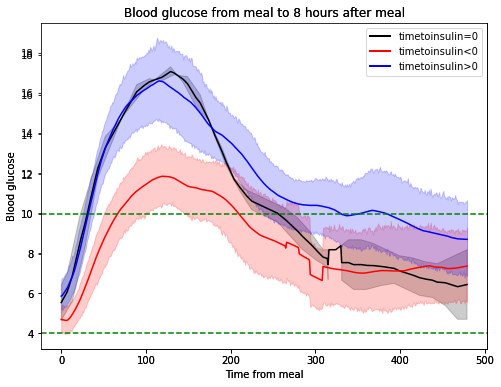

# time_to_insulin
Does time to insulin for a meal change the time not in range after meal or does it matter if i take the insulin before or after meal?

Having type 1 diabetes (https://en.wikipedia.org/wiki/Type_1_diabetes), you want to maximize the time in range TIR (https://diabetes.org/about-diabetes/devices-technology/cgm-time-in-range in my case blood glucose levels between 4-10).
When eating, you need to take insulin in order to minmize the increase of blood glucose, not doing so will push the blood glucose to not in range (NIR).
It is said that the insulin should be taken before meal, in order to test weither it matter or not I had the same meal 26 times and tried to take the insulin both before and after meal.

the meal has the following Nutrional content:

| Type  | Amount |
| ------------- | ------------- |
| Energy | 2628kJ |
| Fat | 15g |
| Protein |25.8g |
| Carbohydrates | 93g |
| Carbohydrates-Sugar | 9.9g |
| Salt |2.7g |

The insulinshot i took was 9 of Novorapid (https://www.ema.europa.eu/en/medicines/human/EPAR/novorapid).
I have a BMI<=20
This was my last meal of the day, minmizing the risk of moving around too much after meal and isolating just the effect of the insulin after meal.

Insulin was taken for different times before and after food, the different times tested for insulin was [-60,-45,-30,-25,-20,-15,0,15,20,25,30,45,60] where -60 means 60 minutes before food and 60 means 60 minutes after food.
Since all time where tested 2 times, there are total 26 rows of data.

The two different datasets:

blood_glucose_after_food:

| Name  | desc |
| ------------- | ------------- |
| tti_data_group | group id for each measurement |
| time_from_meal |time from when meal was eaten (minutes) |
| cgm_blood_glucose | blood glucose measured by the CGM |
| tti_group | 0 if tti=0, 1 if tti<0 and 2 if tti>0 |

The blood glucose was collected from a CGM that has 10 minutes delay so all values where transformed into the correct time and a linear interpolation was done in order to have values for each minute.

time_to_insulin_analysis:

| Name  | desc |
| ------------- | ------------- |
| tti | time to insulin, time between meal and insulin shot |
| tti_group | 0 if tti=0, 1 if tti<0 and 2 if tti>0 |
| nr_steps_after_food | nr steps during test, since they are low they don't have any impact on the blood glucose |
| time_NIR |time spent in NIR after meal |
| blood_glucose_tom | blood glucose at time of meal |

It is the average of the two measurements done on each tti.

